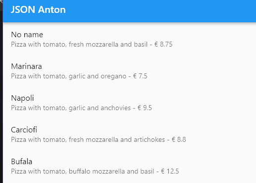
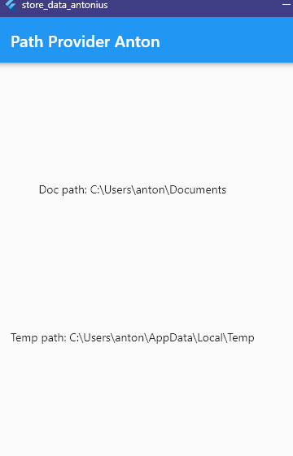
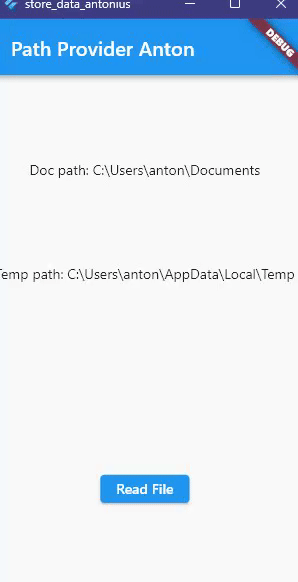
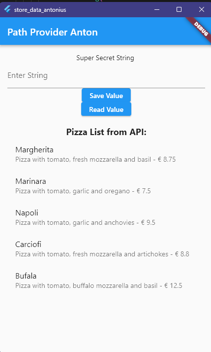
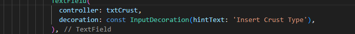
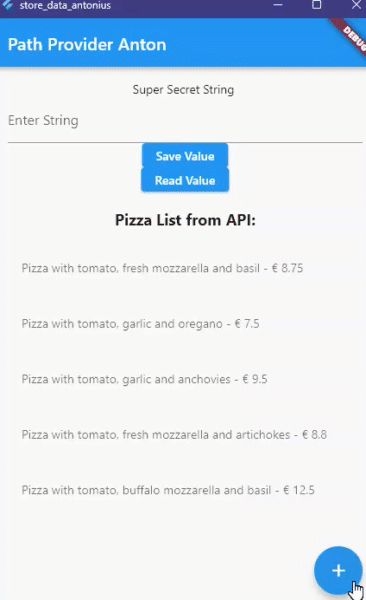
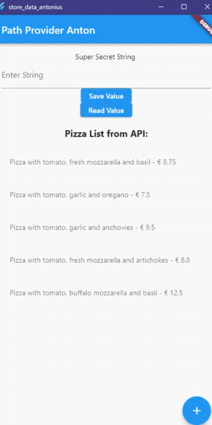
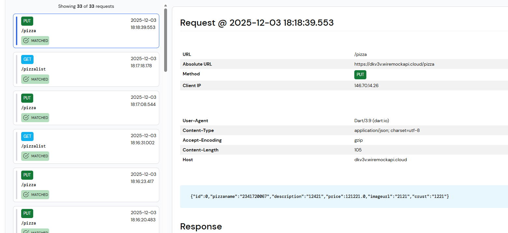
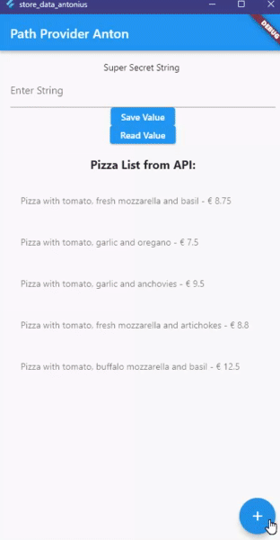
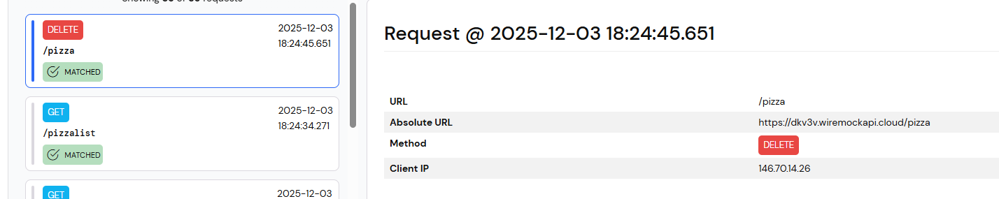

# Practicum 1

1. Tambahkan nama panggilan Anda pada title app sebagai identitas hasil pekerjaan Anda.
Gantilah warna tema aplikasi sesuai kesukaan Anda.
Lakukan commit hasil jawaban Soal 1 dengan pesan "W13: Jawaban Soal 1"
2. Masukkan hasil capture layar ke laporan praktikum Anda.
Lakukan commit hasil jawaban Soal 2 dengan pesan "W13: Jawaban Soal 2"
3. Masukkan hasil capture layar ke laporan praktikum Anda.
Lakukan commit hasil jawaban Soal 2 dengan pesan "W13: Jawaban Soal 3"

# Answer for Practicum 1

1. 

2. 

3. 

# Practicum 2

1. Capture hasil running aplikasi Anda, kemudian impor ke laporan praktikum Anda!
Lalu lakukan commit dengan pesan "W13: Jawaban Soal 4".

# Answer for Practicum 2

1. 

Can display the error:

# Practicum 3

1. Jelaskan maksud kode lebih safe dan maintainable!
Capture hasil praktikum Anda dan lampirkan di README.
Lalu lakukan commit dengan pesan "W13: Jawaban Soal 5".

# Answer for Practicum 3

1. 

Why is this safer and more maintainable?

Safer: It prevents typos (e.g., typing 'ids' instead of 'id'). If we misspell a constant variable name, the code editor will show a red error immediately. If we misspell a string 'ids', the app will just crash silently or show null data.
Maintainable: If the backend changes a key (e.g., from 'pizzaName' to 'name'), we only need to update the value in one place (the constant definition), and it automatically updates everywhere in our app.

# Practicum 4

1. Capture hasil praktikum Anda berupa GIF dan lampirkan di README.
Lalu lakukan commit dengan pesan "W13: Jawaban Soal 6".

# Answer for Practicum 4

1. 

# Practicum 5

1. Capture hasil praktikum Anda dan lampirkan di README.
Lalu lakukan commit dengan pesan "W13: Jawaban Soal 7".

# Answer for Practicum 5

1. 

# Practicum 6

1. Jelaskan maksud kode pada langkah 3 dan 7 !
Capture hasil praktikum Anda berupa GIF dan lampirkan di README.
Lalu lakukan commit dengan pesan "W13: Jawaban Soal 8".

# Answer for Practicum 6

1. 

The writeFile method is an asynchronous function that attempts to access the pizzas.txt file we defined earlier. Inside the try block, the command await myFile.writeAsString('Margherita, Capricciosa, Napoli'); forces the app to open that specific text file in the device's storage and overwrite its contents with the text "Margherita, Capricciosa, Napoli". If this operation finishes without errors, the method returns true to indicate success.

The readFile method works in reverse. It asynchronously opens the same pizzas.txt file and extracts all the text inside it using readAsString(). Once the data is retrieved, setState is called to update the fileText variable with that content, which triggers the Flutter interface to rebuild and display the pizza names on the screen. Both methods use a try-catch block to ensure that if the file system is inaccessible or the file doesn't exist, the app catches the error gracefully and returns false instead of crashing.

# Practicum 7

1. Capture hasil praktikum Anda berupa GIF dan lampirkan di README.
Lalu lakukan commit dengan pesan "W13: Jawaban Soal 9".

# Answer for Practicum 7

1. 

# NEW JOBSHEET 14

# Practicum 1

1. Tambahkan nama panggilan Anda pada title app sebagai identitas hasil pekerjaan Anda.
Gantilah warna tema aplikasi sesuai kesukaan Anda.
Capture hasil aplikasi Anda, lalu masukkan ke laporan di README dan lakukan commit hasil jawaban Soal 1 dengan pesan "W14: Jawaban Soal 1"

# Answer for practicum 1

1. 

# Practicum 2

1. Tambahkan field baru dalam JSON maupun POST ke Wiremock!
Capture hasil aplikasi Anda berupa GIF di README dan lakukan commit hasil jawaban Soal 2 dengan pesan "W14: Jawaban Soal 2"

# Answer for practicum 2

1.  

# Practicum 3

1. Ubah salah satu data dengan Nama dan NIM Anda, lalu perhatikan hasilnya di Wiremock.
Capture hasil aplikasi Anda berupa GIF di README dan lakukan commit hasil jawaban Soal 3 dengan pesan "W14: Jawaban Soal 3"

# Answer for practicum 3

1. 

# Practicum 4

1. Capture hasil aplikasi Anda berupa GIF di README dan lakukan commit hasil jawaban Soal 4 dengan pesan "W14: Jawaban Soal 4"

# Answer for Practicum 4

1. 

